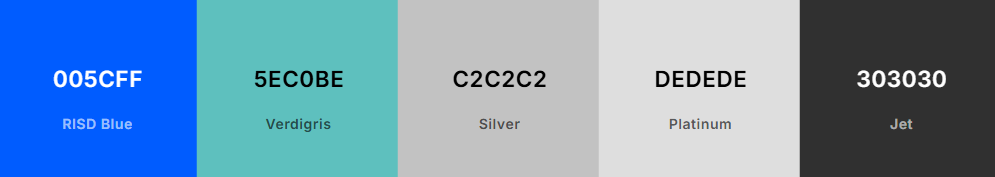
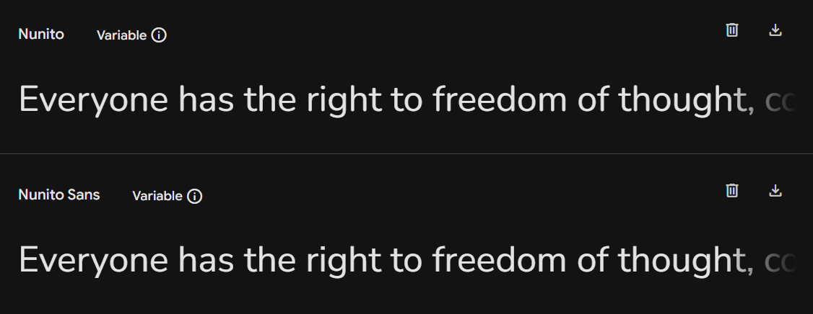

<h1 align="center">
<picture>
  
</picture>
    
E-commerce AVANTI

</h1>

 
    <a href="#Sobre">Sobre</a> |
    <a href="#Contato">Contato</a>

 

### Resumo:
O objetivo principal deste projeto é avaliar minha capacidade técnica no front-end.  
O desafio final consiste em desenvolver um layout proposto no Figma utilizando HTML, CSS e JavaScript.

### Acesse o layout no Figma abaixo:

[Versão desktop e mobile](https://www.figma.com/proto/DqtFxC6312M32mLt8FpJjq/innovation-class?page-id=13%3A673&node-id=13-920&viewport=346%2C140%2C0.11&t=HyGGDSs83f1vbqMJ-1&scaling=scale-down&content-scaling=fixed)

### Requisitos para o desenvolvimento:

1️⃣ Estruturar o HTML conforme o layout do Figma.  

2️⃣ Aplicar estilos com CSS, garantindo um layout responsivo (Versão Desktop e Mobile no Figma.  
O candidato pode utilizar um framework CSS de sua escolha, como Bootstrap, Bulma ou outro.  

3️⃣ Implementar uma funcionalidade de busca com JavaScript:  
No campo de busca, ao clicar no botão da lupa, o texto digitado no campo deve ser exibido abaixo com a mensagem:  
"Você buscou por: 'assunto buscado'" e Implementar a interação dos carrrosséis (Pode ser através de biblioteca).

### Tecnologias Utilizadas:

  
  
  
  
  
  

  

### Desenvolvido até aqui:

- [x] Estrutura HTML/CSS
- [x] Responsividade
- [x] JavaScript
- [x] Animações JS
- [ ] Carrinho
- [ ] Back-end
 
---

### Layout Web:
Page desenvolvida priorizando o [HTML Semântico](https://github.com/luruanx/AVANTI-ecommerce/blob/main/index.html) e as
[CSS responsiva](https://github.com/luruanx/AVANTI-ecommerce/blob/main/assets/style.css). 
 
 

 
    <a href="https://luruanx.github.io/AVANTI-ecommerce/">Clique aqui e veja o resultado</a>
  

 
 

### Sobre:

- ### Identidade Visual

  **Logomarca:** Oficial [Avanti](https://penseavanti.com.br/).    

  **Paleta de Cores:** 

    
  

    
  
    

  **Font-Family:**

   

  

    

---

### Contato:

  

  Estou total aberto a conselhos, elogios ou sugestões. **"Todo conhecimento é bem vindo!"**, dar um alô aí!!

   

